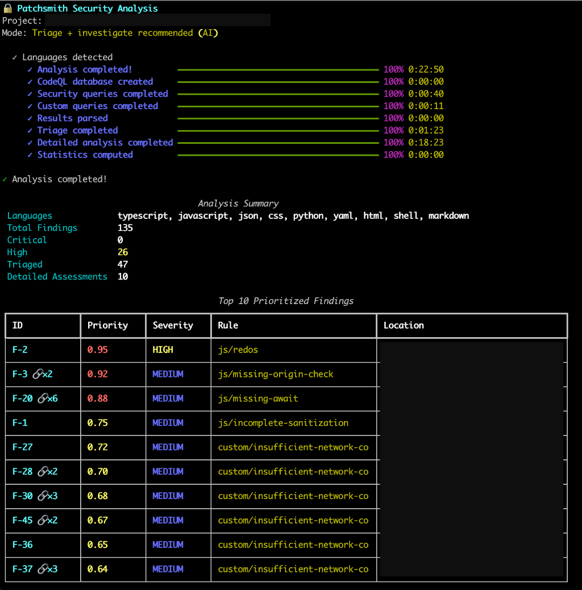

# 🔒 Patchsmith

**AI-Powered Security Vulnerability Detection and Fixing**

Patchsmith combines the power of [CodeQL](https://codeql.github.com/) static analysis with [Claude AI](https://www.anthropic.com/claude) to automatically detect, triage, and fix security vulnerabilities in your codebase.

[](https://www.python.org/downloads/)
[](https://www.gnu.org/licenses/gpl-3.0)
[](https://github.com/psf/black)

---

<p align="center">
  
</p>

<p align="center">
  <em>Patchsmith's CLI interface with real-time progress tracking, intelligent triage, and comprehensive security reports</em>
</p>

---

## ✨ Features

- 🔍 **Static Analysis** - Powered by GitHub's CodeQL engine
- 🤖 **AI Triage** - Intelligent prioritization and grouping of security findings
- 🔗 **Smart Grouping** - Automatically groups similar findings to avoid redundant analysis
- 🔬 **Detailed Assessment** - Comprehensive security analysis with attack scenarios
- 🎯 **Custom Queries** - AI-generated CodeQL queries tailored to your project
- 🛠️ **Automated Fixing** - AI-generated patches for vulnerabilities
- 📊 **Rich Reports** - Detailed reports in Markdown and HTML
- 🎨 **Beautiful CLI** - Intuitive interface with progress tracking
- 🔄 **Git Integration** - Automatic branching and commits for fixes

## 🚀 Quick Start

### Prerequisites

1. **Python 3.10+**
   ```bash
   python --version  # Should be 3.10 or higher
   ```

2. **CodeQL CLI** (required for analysis)
   ```bash
   # Download from GitHub releases
   # https://github.com/github/codeql-cli-binaries/releases

   # On macOS with Homebrew:
   brew install codeql

   # Verify installation:
   codeql version
   ```

3. **Anthropic API Key** (required for AI features)
   - Sign up at [console.anthropic.com](https://console.anthropic.com/)
   - Get your API key
   - Configure using one of these methods:
     ```bash
     # Option 1: Save to user config (recommended)
     patchsmith init --save-api-key

     # Option 2: Environment variable
     export ANTHROPIC_API_KEY='your-api-key-here'

     # Option 3: Create ~/.patchsmith/config.yaml
     # anthropic_api_key: 'your-api-key-here'
     ```

### Installation

#### Option 1: Install from Source (Development)

```bash
# Clone the repository
git clone https://github.com/yourusername/patchsmith.git
cd patchsmith

# Install with Poetry
poetry install

# Run Patchsmith
poetry run patchsmith --help
```

**Using Poetry Shell for Other Repositories**

To analyze other projects without prefixing every command with `poetry run`, activate the Poetry virtual environment:

```bash
# From the patchsmith directory, activate the virtual environment
poetry shell

# Now you can use patchsmith directly on any repository
cd /path/to/your/project
patchsmith init
patchsmith analyze --investigate

# Exit the virtual environment when done
exit
```

This approach is especially useful when working with multiple projects, as you can navigate anywhere and run `patchsmith` commands directly without the `poetry run` prefix.

## 📖 Usage

### Initialize a Project

```bash
cd /path/to/your/project
patchsmith init
```

### Run Security Analysis

```bash
# Quick triage (fast, groups findings, assigns priorities)
patchsmith analyze

# Full analysis with deep investigation of top 10 groups
patchsmith analyze --investigate

# Analyze specific project
patchsmith analyze /path/to/project --investigate

# Save results to file
patchsmith analyze -o results.json
```

### Generate Custom Queries

```bash
# Generate project-specific CodeQL queries
patchsmith finetune

# Focus on specific security concerns
patchsmith finetune --focus "SQL injection and authentication bypass"

# Use custom queries in analysis
patchsmith analyze --investigate
```

### List Findings

```bash
# List all findings with grouping info
patchsmith list

# Show only critical findings
patchsmith list --severity critical
```

### Investigate Specific Finding

```bash
# Deep investigation of a specific finding
patchsmith investigate F-20
```

### Generate Report

```bash
# Generate markdown report
patchsmith report

# Generate HTML report
patchsmith report --format html
```

### Fix Vulnerabilities

```bash
# Interactive mode (recommended)
patchsmith fix --interactive

# Fix specific finding
patchsmith fix <finding-id>

# Auto-apply fix (use with caution!)
patchsmith fix <finding-id> --apply
```

### Clean Cached Data

```bash
# Clean cached results (keeps database)
patchsmith clean

# Remove everything including database
patchsmith clean --all
```

## 🔄 Workflow

Patchsmith uses a **two-tier analysis system**:

1. **Triage (Always Runs)** - Fast analysis that:
   - Groups similar findings (e.g., 6 instances of same pattern → 1 group)
   - Assigns priority scores to all groups
   - Marks top 10 groups for deep investigation
   - Takes ~5-20 minutes

2. **Investigation (Optional with `--investigate`)** - Deep AI analysis that:
   - Analyzes top 10 priority groups in detail
   - Generates attack scenarios and impact assessments
   - Provides exploitability scores and remediation guidance
   - Takes additional ~10-30 minutes

**Grouping Example:**
```
50 raw findings → 15 distinct groups → top 10 investigated
```

**Grouping Indicators:**
- `F-20` - Single finding
- `F-20 🔗×6` - Group of 6 similar findings

This approach saves time and API costs while ensuring thorough analysis of critical issues.

## 📚 Documentation

- **[CLI Guide](CLI_GUIDE.md)** - Complete command reference and examples
- **[Architecture](documentation/sdd/v1/design.mdsign.md)** - Technical design and architecture
- **[Requirements](documentation/sdd/v1/requirements.mdents.md)** - Full requirements specification

## 🏗️ Architecture

```
┌──────────────────────────────────────────────────────────┐
│  Layer 4: Presentation                                   │
│  • CLI (Rich UI)                                         │
│  • HTTP API (coming soon)                                │
├──────────────────────────────────────────────────────────┤
│  Layer 3: Orchestration                                  │
│  • Workflow management                                   │
│  • Exception and error handling                          │
│  • Progress tracking                                     │
├──────────────────────────────────────────────────────────┤
│  Layer 2: Custom Agents                                  │
│  • Analysis agents (triage, investigation)               │
│  • Brainstorming agents (vulnerability suggestions)      │
│  • Review agents (fix validation)                        │
│  • Code generation agents (query, patch)                 │
├──────────────────────────────────────────────────────────┤
│  Layer 1: Tools Wrapper                                  │
│  • CodeQL CLI                                            │
│  • Git                                                   │
│  • GitHub API                                            │
└──────────────────────────────────────────────────────────┘
```

## 🧪 Testing

```bash
# Run all tests
poetry run pytest

# Run with coverage
poetry run pytest --cov

# Run manual end-to-end test
poetry run python tests/manual_test_service_layer.py /path/to/project
```

## 📜 License

Patchsmith is free and open-source software licensed under the **GNU General Public License v3.0 (GPL-3.0)**.

This means you can:
- ✅ Use Patchsmith for any purpose (commercial or personal)
- ✅ Study and modify the source code
- ✅ Distribute copies of Patchsmith
- ✅ Distribute modified versions

**Requirements:**
- 📋 Any distributed modifications must also be open-source under GPL-3.0
- 📋 You must include the original license and copyright notices
- 📋 You must state significant changes made to the software

See the [LICENSE](LICENSE) file for the full license text.

**Why GPL-3.0?** We believe security tools should be transparent and open. The GPL ensures that improvements to Patchsmith remain available to the entire security community.

## 🙏 Acknowledgments

- **[CodeQL](https://codeql.github.com/)** - Semantic code analysis by GitHub
- **[Claude AI](https://www.anthropic.com/claude)** - AI assistant by Anthropic
- **[Rich](https://rich.readthedocs.io/)** - Beautiful terminal formatting

---

**Made with ❤️ by [Transcode](https://transcode.be) for secure software development**
